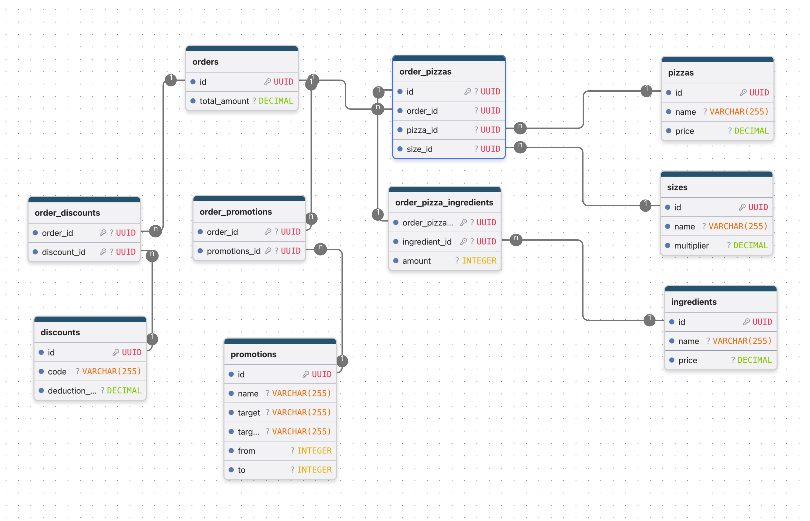

# rails-pizza-challenge
Interview codding

## 09/07/2026 - 15:00

Welcome!

I started the coding challenge. Before writing any code, I decided to think about what and why I should write to avoid any design and architectural problems in the future and meet the requirements.

## 09/07/2026 - 17:00

After thinking a little bit, I came to several thoughts like this:

1. I want to keep sweet Rails out-of-the-box functionality like enums and adding and removing associations as you're working with some kind of array.
That will in the future avoid boilerplate and make a better and nicer frontend since Hotwire is actively using that feature while sending and receiving JSONs.
Also it's more testable and understandable for other programmers.

2. I want to keep the ActiveRecord interface as clean as possible and don't lose that functionality because it's a standard.
What do I mean? I want to use something like this:

```ruby
# views
pizza.ingredients.each { |ingredient|
  ingredient.name
  ingredient.count
}

pizza.ingredients.added   -> naming speaks for itself
pizza.ingredients.omitted -> naming speaks for itself
```

3. This could be very important for the kitchen. I want to make it a little bit "real time".
What do I mean is to be sure that Hotwire would be able to get updated JSON every time when something is changed in the order.
The complexity here is how to keep it as simple as possible — i.e., don't make too many requests to the DB and don't get stuck in callback hell.

4. Keep database queries as optimized as possible. Don't make useless queries while rendering views and while making calculations of price.

## 09/07/2026 - 18:00

I started from making the DB design. And followed all the rules of making a normalized database design.
Here is what I got:

- created_at and updated_at are omitted for simplicity's sake.
- Have to add complete: boolean column to orders table




## 09/07/2026 - 19:00

Now thinking about how queries would look like, how the interface would look like, and what can go wrong.
And the most important – what should happen every time if anything is changed, i.e. if more pizzas are added or ingredients omitted but then added again, etc.
This is the most problematic part of the project because of promotions.
Adding or removing a pizza should recalculate everything because promotions should know how many pizzas are in the order in total.
Or changing the size of the pizza also may lead to recalculating everything because promotions are applicable for the exact size of the pizza, etc.
Also I went a bit further and decided that it should be possible to view each pizza's price while making an order, because usually you see each pizza price.
I know it's not in the requirements, but I thought it's a good way to design a program :).
Please let me know if it's not necessary.

So here I'm trying to understand what should happen when something is created, updated, or changed through ActiveRecord:

order.create
- just create an order
- complete is false by default
- should fire a callback to Hotwire and update orders on the frontend

order.update
- should fire a callback to Hotwire and update orders on the frontend

order.destroy
- should remove all associated order_pizzas (dependent destroy)
- should remove all associated order_promotions (dependent destroy)
- should remove all associated order_discounts (dependent destroy)
- should fire a callback to Hotwire and update the order on the frontend

order_pizzas.create
- take the pizza default size
- RECALCULATE WHOLE ORDER if size changed

order_pizzas.update

- validations
- RECALCULATE WHOLE ORDER if size changed

order_pizzas.delete/destroy
- should remove all associated order_pizza_ingredients (dependent destroy)
- RECALCULATE WHOLE ORDER

order_promotions.create
- validations
- RECALCULATE WHOLE ORDER

order_promotions.destroy
- RECALCULATE WHOLE ORDER

order_discounts.create
- validations
- RECALCULATE WHOLE ORDER

order_discounts.destroy
- RECALCULATE WHOLE ORDER

order_pizza_ingredients.create
- validations
- default amount 0 means ingredient is omitted
- RECALCULATE WHOLE ORDER

order_pizza_ingredients.update
- validations
- RECALCULATE WHOLE ORDER

order_pizza_ingredients.destroy
- RECALCULATE WHOLE ORDER

## 09/07/2026 - 22:00

So as you can see, this approach has a bottleneck: it should recalculate the whole order with every change.
Let's say if ingredients are added or removed, a callback is called to recalculate everything.
Or if an OrderPizza is removed, it may call a callback, then each order_pizza_ingredient may call a callback because it's also changed, which may easily lead to CallbackHell.
Of course I can avoid all these problems and make sure that problems will not appear, but it's still not a good design.
Also testing and debugging callbacks is not that easy.
And RECALCULATE WHOLE ORDER is gonna make a lot of requests to the DB.
Basically it should know everything about the order to make the total calculation.

## 10/07/2026 - 14:00

So based on everything I was writing before, I came to a conclusion that it's better to not use a normalized DB.
Instead of it, it's better to keep everything related to an order in the orders table.
And to make it work I want to use ActiveRecord Store.
It's also possible to use JSONB in Postgres to make it more robust.
Here is how the schema could look like:

Simply gonna create these tables as in the diagram before:
- pizzas
- ingredients
- sizes
- discounts
- promotions

And create an orders table with a details attribute which will store everything:

orders:
  id: uuid
  details: STORE (perhaps JSONB)
  total_amount: decimal
  created_at: datetime
  updated_at: datetime

Here are some benefits of it:

- since everything is in order details, it will drastically eliminate the amount of requests to the DB
- easy calculations, only order.details are needed
- I'm not sure here, but I think it's possible to make transactions safer and eliminate the chance of getting cross-table locks, especially if some sort of async processes could be involved.
I was having this kind of issues before.
- fewer callbacks (I really love callbacks, but here it's not the best idea to use them)
- less ambiguity
- easier to test
- easy way to render order JSON
- easy to handle frontend refreshes, just fire a callback to Hotwire when the order is changed
- since prices are gonna be fixed in order.details when the order is created, later manipulation of the DB will not lead to wrong total_amounts. This is kind of important.

And of course the cons:

- JSONB is not that fast for queries
- the DB is less normalized
- I have to decide how to organize the code to avoid writing the whole logic in one class
- it's an antipattern for the Ruby on Rails world

## 10/07/2026 - 18:00

All the things said above — it's better to ask colleagues or reviewers which approach is more preferable before writing any line of code.
I'm sorry that I didn't write any line of code yet, but I'm pretty sure that opinions of colleagues and a good architectural design are more important than just writing code.
Also I'm pretty confident in my coding abilities since I've been doing it for many years 😉
Please let me know what you think about this, and also help me see what is the best way to do this.
Thanks for your attention.